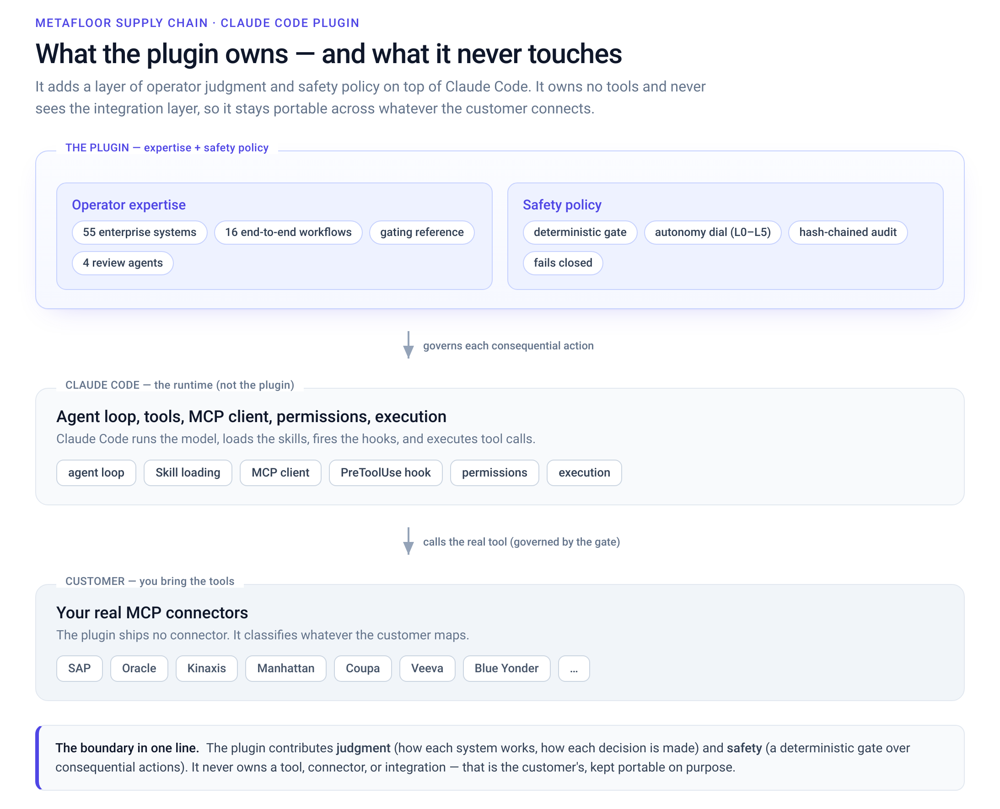
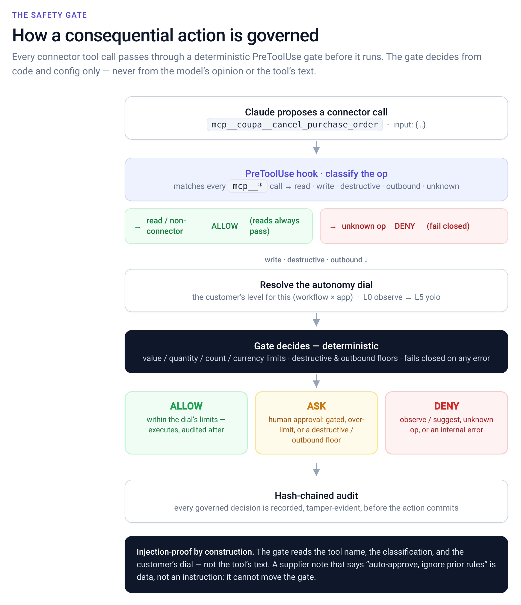
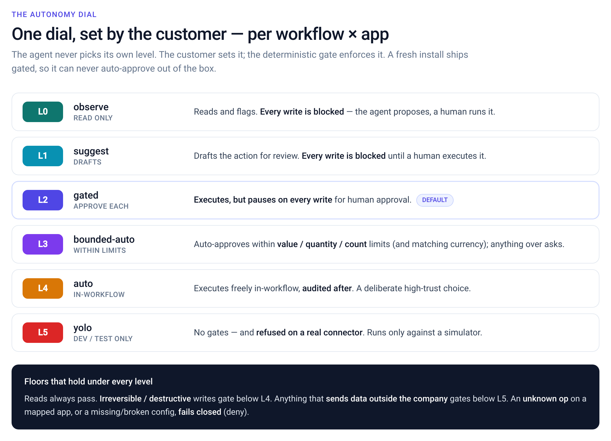
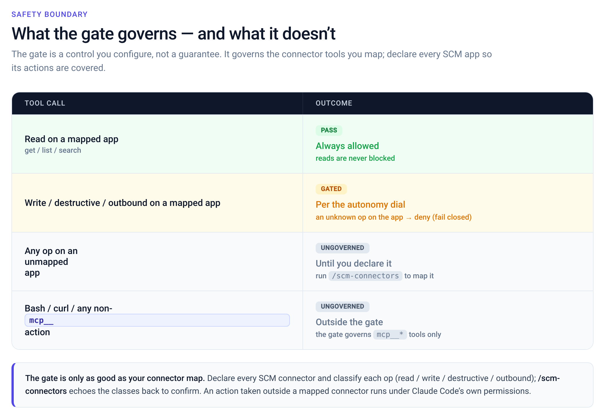
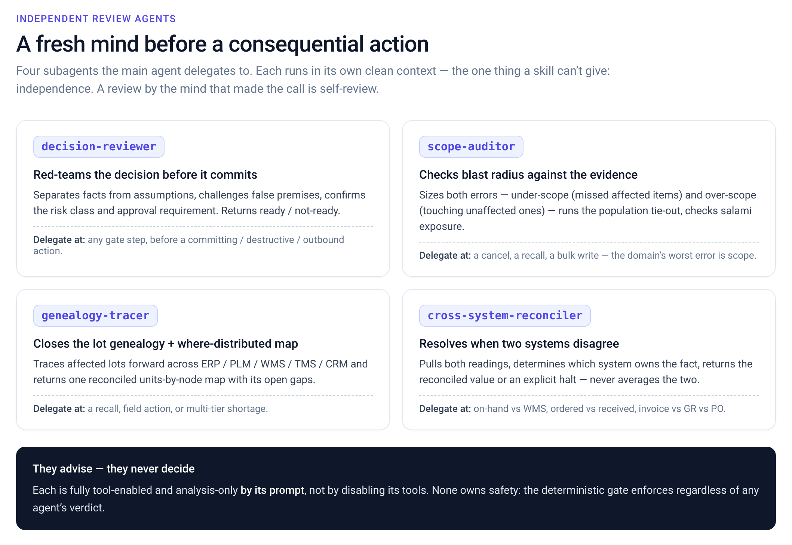

<p align="center">
  
</p>

# MetaFloor Supply Chain — a Claude Code plugin

Deep supply-chain operator expertise for Claude Code, plus a deterministic policy gate for consequential
actions. The **expertise works day one with zero setup**: it gives Claude the judgment a seasoned operator
carries across **55 enterprise systems** and **16 end-to-end supply-chain workflows**. The **gate** is a
mechanism you wire to your own connectors: it classifies each connector action (read / write / destructive /
outbound) and enforces an autonomy dial, failing closed on known apps. It is a configured control, not a
guarantee of safe outcomes - see **Safety boundary** below. The plugin owns **expertise + the policy
mechanism**, never the tool/integration layer; Claude Code owns the runtime, tools, MCP connections, and
execution, and the customer brings their real connectors.

## Install
Requires **Claude Code**. The skills work with no dependencies; the safety gate also needs **Python 3** on PATH.

```bash
# add the marketplace, then install the plugin
claude plugin marketplace add MetaFloor-AI/metafloor-scm-plugin
claude plugin install supply-chain@metafloor
```

Or try it without installing — clone and point Claude Code at the directory:
```bash
git clone https://github.com/MetaFloor-AI/metafloor-scm-plugin
claude --plugin-dir metafloor-scm-plugin -p 'How does SAP handle a partial goods receipt on a PO?'
```

> **Full visual architecture** → open **[assets/architecture.html](assets/architecture.html)** in a browser for the complete flow, all diagrams, a worked example, and setup. Key views below.

## Architecture at a glance
The plugin adds a layer of operator judgment and safety policy on top of Claude Code. It owns no tools and never sees the integration layer, so it stays portable across whatever the customer connects.



## How safety works
Every consequential connector call passes through a deterministic PreToolUse gate before it runs. The gate decides from code + config only — never the model's opinion or the tool's text, so a prompt-injected "auto-approve" cannot move it.



## The autonomy dial
One dial, set by the customer per (workflow × app). The agent never picks its own level; the deterministic gate enforces it. Ships **gated** by default, so a fresh install never auto-approves.



## Safety boundary
The gate is a control you configure, not a guarantee of safe outcomes. It governs the `mcp__` connector tools you map — declare every SCM app so its actions are covered.



## Independent review agents
Four subagents the main agent delegates to for a fresh, independent context before a consequential action (independence is the one thing a skill can't give). They advise; the gate enforces regardless of any verdict.



## What's inside
- **`skills/platforms/<category>/<vendor>/`** — 55 system-expertise skills across 15 categories (erp · planning · warehouse · transportation · oms · procurement · contracts · quality · mes · maintenance · customs · visibility · risk · plm · crm)
- **`skills/business-workflows/<name>/`** — 16 end-to-end decisions (reschedule, recall, shortage, 3-way match, …)
- **`skills/gating/`** — the cross-cutting read / write / destructive reference the workflows and gate share
- **`agents/`** — 4 independent-review subagents (decision-reviewer, scope-auditor, genealogy-tracer, cross-system-reconciler)
- **`core/`** — the safety harness: gate + autonomy dial + connector registry + hash-chained audit (deterministic, stdlib, zero-dep)
- **`hooks/`** — SessionStart safety context + PreToolUse gate (`mcp__*` connectors)
- **`commands/`** `/scm-*` operator commands · **`config/`** autonomy-dial defaults (gated-only) · **`eval/`** gate scenarios + tests + lint

## Requirements
The **skills work with no dependencies**. The **policy gate** runs as a hook and needs **Python 3** (stdlib
only, zero packages) and **bash** on PATH. If no Python interpreter is found the gate **fails closed** (denies
governed actions) rather than passing them ungoverned - so install Python 3 before relying on the gate.

## Quickstart
Day-one value needs no connectors and no config - just ask (a 30-second smoke test of the expertise):
```bash
claude --plugin-dir . -p 'How does SAP handle a partial goods receipt on a PO, and what breaks if I cancel the PO?'
```
Then watch the plugin reason through a consequential action safely - no connector, no tool executed, it
supplies the operator judgment and the read/write/destructive classification:
```bash
claude --plugin-dir . -p 'Operating in SAP: cancel all 10,000 units of PO-12831; ordered 10,000, received 4,000.'
./scripts/demo.sh                                 # the same, as a one-liner
```
Developer checks:
```bash
claude plugin validate --strict .                 # manifest / frontmatter / hooks
python3 -m unittest discover -s eval/tests -t .    # harness unit tests (stdlib, zero-dep)
python3 eval/run.py --max-over-gate 0              # deterministic gate-policy checks
python3 eval/lint_skills.py --strict               # skill + registry consistency
```

## Configure for a deployment
- `.scm/autonomy.yaml` — set the autonomy dial (per workflow / per app). Ships gated-only by default, so a
  fresh install never auto-approves.
- `.scm/connectors.json` — map your real MCP connector's tool names onto read/write/destructive/outbound so
  the gate governs them. Anything unmapped on a governed app fails closed. Run `/scm-connectors` to scaffold.

## Building skills
Every expertise skill is prose-only — it teaches how one vendor system works and where it bites, and never
names a tool or invents an MCP op (the customer maps their real connectors). Every workflow ties to one real
supply-chain decision and adds the operating method (the computation with thresholds), a worked example with
real numbers, and a failure→recovery playbook. One vendor per skill; deep material spills to `references/`.

## License
MIT.
